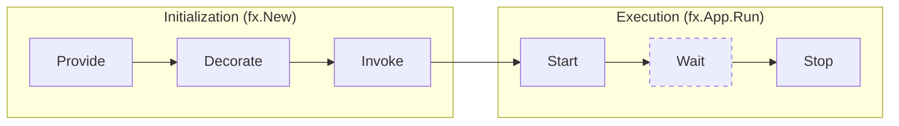
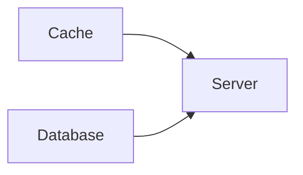

# Application lifecycle

The lifecycle of an Fx application has two high-level phases:
*initialization* and *execution*.
Both of these, in turn are comprised of multiple steps.

During **initialization**, Fx will,

- register all constructors passed to `fx.Provide`
- register all decorators passed to `fx.Decorate`
- run all functions passed to `fx.Invoke`,
  calling constructors and decorators as needed

During **execution**, Fx will,

- run all startup hooks appended to the application
  by providers, decorators, and invoked functions
- wait for a signal to stop running
- run all shutdown hooks appended to the application



## Lifecycle hooks

Lifecycle hooks provide the ability to schedule work to be executed by Fx,
when the application starts up or shuts down.
Fx provides two kinds of hooks:

- *Startup hooks*, also referred to as `OnStart` hooks.
  These run in the order they were appended.
- *Shutdown hooks*, also referred to as `OnStop` hooks.
  These run in the **reverse** of the order they were appended.

By default, Fx runs lifecycle hooks sequentially. Applications may opt into
dependency-aware parallel execution with `fx.ParallelHooks`:

```go
app := fx.New(
    fx.ParallelHooks(4),
    fx.Provide(NewCache, NewDatabase, NewServer),
    fx.Invoke(func(*Server) {}),
)
```

The argument is the maximum number of hooks that may run concurrently and
must be greater than zero. Hooks belonging to independent branches of the
dependency graph may overlap. Hooks belonging to the same constructor retain
their append order, and a component's startup hooks wait for its dependencies:



In this example, the cache and database hooks may start concurrently, but the
server waits for both. Shutdown reverses the graph: the server stops before the
cache and database, which may then stop concurrently.

Fx associates hooks with the constructor, decorator, or invocation that
appended them. A hook appended outside one of those calls cannot be associated
with a dependency graph node, so Fx treats it as a synchronization barrier and
preserves the global append order around it.

If a startup hook fails, Fx stops scheduling new hooks and waits for hooks that
are already running. Errors from those hooks are reported together, and Fx
rolls back every hook that started successfully. Startup and shutdown still
share their respective overall timeout configured by `fx.StartTimeout` and
`fx.StopTimeout`.

Typically, components that provide a startup hook
also provide a corresponding shutdown hook to
release the resources they acquired at startup.

Fx runs both kinds of hooks with a hard timeout enforcement.
Therefore, hooks are expected to block only as long as they need
to *schedule* work.
In other words,

- hooks **must not** block to run long-running tasks synchronously
- hooks **should** schedule long-running tasks in background goroutines
- shutdown hooks **should** stop the background work started by startup hooks
